# Clasificación de Imágenes por objetos y redes neuronales

Dr. Rodrigo López Farías

``` R
y = 1
t <- 5
```


``````python
for i in range(len(x)):
  print(i)
``````


## Unidad 1. Introducción a las técnicas de Clasificación

1.0 Introducción al  aprendizaje automático.

* En los primeros días de la inteligencia artificial, este campo tomó y resolvió los primeros problemas que intelectualmente son difíciles para los humanos pero muy fáciles para las computadoras. 
* Se ha cuestionado que es inteligencia Artificial. Si no es inteligencia humana que es?  
  * Deep y deeper Blue que derrotaron al ajedrecista Gary Kaspárov en 1996. Es una Inteligencia Artificial?
  *  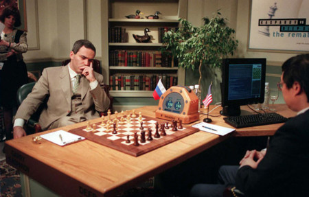

https://www.professional-ai.com/deep-blue-algorithm.html


Retos de la inteligencia Artificial

* Resolver problemas fáciles e intuitivos  pero que son difíciles de describir formalmente para las personas. 
* Por lo tanto parte de este problema consiste en resolver como el conocimiento informal debe ser representado en una computadora.


Representación de una Imagen en una Matriz.  

Ejemplos de problemas que son fáciles para los humanos pero difíciles para las computadoras.

* Entender el lenguaje natural.
* Inferir el sentimiento de las personas.
* Traducción Automática
* Clasificación de Imágenes.
* Reconocimiento de objetos.
* Qué otros problemas los humanos pueden resolver fácilmente? 
  * La Justicia


Hay otros problemas que van mas allá de tema pero vale la pena mencionar que son aquellos problemas de decisión difíciles para las computadoras y para los humanos. El problema es si los humanos queremos delegar a una computadora la toma de decisiones éticas.  

* Decisiones éticas. 


https://www.technologyreview.com/2018/10/24/139313/a-global-ethics-study-aims-to-help-ai-solve-the-self-driving-trolley-problem/


Por lo tanto, el Aprendizaje automático consiste en dar solución a estos problemas intuitivos aprendiendo de la experiencia. 

En aprendizaje profundo, la idea principal es  entender la información como una jerarquía de conceptos complicados a partir de otros conceptos mas simples.

En los inicios se intentó crear inteligencia artificial con codificación "dura". (Introducción explicita de reglas de inferencia en una base de datos llamado Enfoque de **Conocimiento Base** para la inteligencia artificial)

La rigidez de este tipo de enfoque, sugiere que los sistemas de IA, deben tener la habilidad de adquirir su propio conocimiento, extrayendo patrones de los datos en bruto. Esta capacidad de las computadoras se le llama Aprendizaje Automático (AA) o **"Machine Learning"**.

AA pudo hacer que las computadoras aborden problemas complejos para los humanos utilizando el conocimiento del mundo real  para tomar decisiones que parecen subjetivas. Por ejemplo, uno de los primeros éxitos es la implementación de una regresión logística simple que es capaz de recomendar o no parto por cesárea a los médicos.  (Principio utilizado por las redes neuronales) 

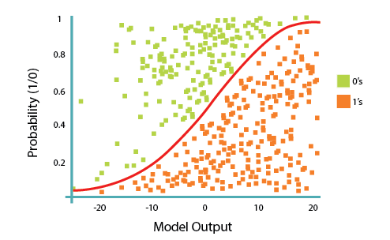

El truco para que funcionen estos modelos reside en **una buena representación de los datos** que incluye una **selección de características** cuidadosa  por un experto.

Una mala selección o representación de datos, genera malos algoritmos predictivos. 

Para muchas tareas del mundo real es muy complicado distinguir las características que deben ser utilizadas para entrenar un modelo. 

Por ejemplo, como distinguir una persona de un carro, o de un perro.

Para esto, una solución es utilizar **AA para aprender automáticamente la representación misma de los datos**. 

Cuando se diseñan algoritmos para aprender características, una de las metas es distinguir los factores invariables o características de los factores de variación  o ruido que explican los datos observados. 


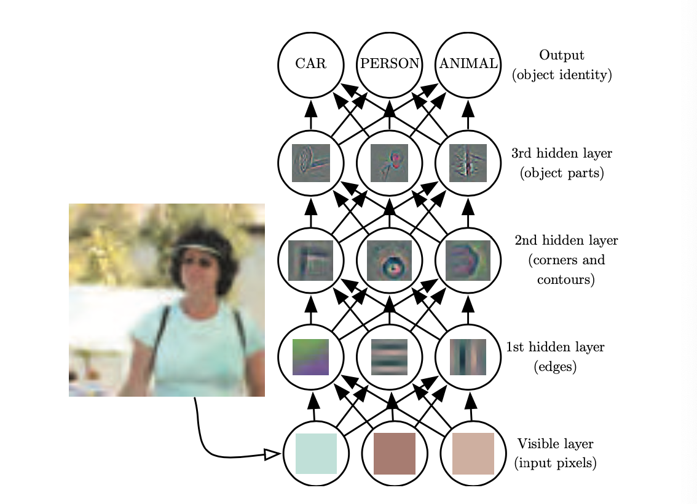

ML responde a la pregunta de cuál es el mejor modelo para explicar datos.

Ejemplo de como el aprendizaje profundo extrae características importantes

Qué características invariantes representan a un gato o a un perro?

**Machine Learning es una subárea de de la IA que detecta patrones de manera automática en los datos**


### Antecedentes

****

Los modelos predecesores, están basados en modelos lineales simples, que trataron de asociar (o mapear) una entrada de tamaño $n$ $ \mathbf{x}= \{x_1,x_2,\dots,x_i,\dots,x_n\}$ a una salida $y_i$. 

Estos modelos aprenden un conjunto de pesos $\mathbf{w} = \{w_1,w_2,\dots,w_n\}$., para ajustar una función $f$:

$$f(\mathbf{x},\mathbf{w}) = x_1 w_1+x_2 w_2 + \dots+x_n w_n$$ 

tal que la suma de los errores $\sum ( f(\mathbf{x}_i, \mathbf{w}) - y_i)$ sea la mínimo.


**Ecuación de la recta**


$$y_i = \mathbf{w}x_i + b $$


**Primera Tarea: 1 ejemplo de aplicación de la ecuación de la recta.**


Ola Cero

 (McCulloch and Pitts, 1943) Utiliza el modelo lineal simple 

$$ sign(f(\mathbf{x},\mathbf{w})) \in \{-1,1\}$$ 

Este modelo puede reconocer dos categorías. Los pesos $\mathbf{w}$ son ajustados manualmente. **No existe un mecanismo de entrenamiento.**

En ese tiempo sale la primera computadora digital de propósito general: ENIAC 


Primera ola: 

Cibernética (1940-1960, Rosenblatt 1958). Impulsado por la teoría de aprendizaje Biológico. Nace el Modelo Perceptrón., que es el primer modelo de una sola neurona capaz de aprender de los datos.

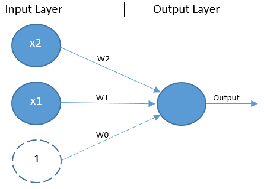

https://medium.com/@jayeshbahire/the-xor-problem-in-neural-networks-50006411840b


(Minsky and Papert, 1969) Estos modelos lineales tienen limitaciones. El mas famoso es la incapacidad de resolver la función XOR. 


**Tabla de verdad de la operación lógica xor**

x | xor | y 

0 | xor |0 = 0

0 | xor | 1 = 1

1 | xor|1 = 0

1 |xor | 0 = 1 

Segunda ola: Conexionismo: (1980-1995, Rumelhart ) Impulsado por por red neuronal con una o dos capas ocultas que resuelve el problema del XOR agregando una capa oculta.


Tercera ola: 1995 - Deep Learning. Impulsado por Redes Neuronales Multi-Capa y algoritmo De Gradiente Estocástico Descendente.


Hochreiter (1991) y Bengio et al. (1994), Se identifico otro problema con el aprendizaje profundo que eses el modelado de secuencias muy largas, para esto Hochreiter y Schmidhuber (1997) propusieron  the long short-term memory (LSTM) para resolver estos problemas. LTSM es una red neuronal recurrente que incorpora una operación para definir el qué tanto importa recordar la información para hacer una Clasificación o regresión.


Deep Learning son un tipo de aprendizaje automático que, ademas de encontrar una función de mapeo para asociar un conjunto de características $\mathbf{x}$ con una salida datos ($\mathbf{y}$), internamente logran aprender como representar esos datos.  


Técnicas modernas de AP, toman ideas de muchas otras áreas, como 

* Álgebra Lineal
* Probabilidad
* Teoría de la información
* Optimización Numérica


## Tipos de Aprendizaje automático

Tomando como guía la figura del diagrama de Venn,  y enfocándonos en el área de Aprendizaje Automático, podemos identificar  dos grandes  de tipos de aprendizaje. 

###  1) Aprendizaje Supervisado

El aprendizaje supervisado trata de aprender una función de mapeo aproximada $\hat{f}: \mathbf{x}_i \rightarrow {\hat{y}_i} $ a la función real $f:\mathbf{x}_i \rightarrow {y_i}$ dado un conjunto de pares de datos etiquetados

 $$D = \{(\mathbf{x}_i,y_i)\}^N_{i=1}$$ 

donde:

* $D$: es el conjunto de entrenamiento. 

* $N$: número de muestras

* $\mathbf{x}_i$: Atributos o características, pueden ser discretas, continuas o reales.

* $y_i$: Variable Categórica con valores **(Clasificación)** $y_i \in \{1,\dots,C\}$, o **(Regresión)** $y_i \in R^{Dim}$

* Si $C = 2$ significa que trata de un problema de **clasificación binaria**.

* Cuando C>2, se le llama **clasificación Multi-clase.**

* Si un objeto puede pertenecer a diferentes clases al mismo tiempo se le llama **clasificación Multi-etiqueta**. 

* La meta principal es ajustar una función de aproximación con capacidad de **generalización**  para clasificar de manera adecuada los datos mas allá del conjunto de entrenamiento.

  

  

  

  Ejemplo:

* Árboles de clasificación
* Clasificación por mínima distancia
* Redes neuronales. 
* Modelos gausianos
* Modelos Bayesianos
* Máquina de Soporte de Vectores

### 2) Aprendizaje No supervisado

Este tipo de aprendizaje tiene un enfoque descriptivo con datos que no están previamente etiquetados. El conjunto de datos se se representa como 

$$D = \{\mathbf{x}_i\}^N_{i=1}$$.

 La finalidad es encontrar la estructura general de los datos es de utilidad para: 

* Etiquetado automático, cuando el etiquetado supervisado es imposible o muy costoso.
* Resuelve el problema de encontrar clúster o grupos de datos en los datos.
* Descubre factores latentes. (aquellas variables que dan mas información sobre el conjunto de datos).
* Estimación de densidades de distribución.

Aplicación de ejemplo: Descubrir cuántos grupos de datos existen en los datos. Lado Izquierdo, datos sin clasificar del peso y la altura de cada persona. En la derecha detección de dos grupos diferentes.

* 

Modelos relacionados

* k-medias
* Mapas auto-organizados
* Dendrogramas
* 

Otros modelos no supervisados se pueden consultar en 

https://www.cienciadedatos.net/documentos/37_clustering_y_heatmaps#Ejemplo_divisivo

### Predicción Probabilista en la clasificación de los datos.

* La predicción probabilista nos permite manejar casos que no son claros para el humano. 

* Es deseable que exista una función de probabilidad la cual para una entrada, arroje una probabilidad de pertenecer a una clase. 

* La probabilidad de que un  dato o vector de entrada pertenezca a una clase se puede expresar utilizando **probabilidad condicional**:

  $$p(y|\mathbf{x},D)$$


  Dónde $D$: es el conjunto de datos, $\mathbf{x}$ es el vector de entrada y la función regresa un valor entre 0 y 1.

  Para seleccionar la mejor estimación se utiliza un estimador de **Maximum a posteriori**

  $$\hat{y} = \hat{f}(\mathbf{x}) = \text{ argmax }_{c}  p(y=c|\mathbf{x},D)$$

donde $c\in \{1,\dots,C\}$

### Aplicaciones

* Clasificación de Documentos y filtro de spam. (La probabilidad de que un documento pertenezca a spam)
* Clasificador de flores.
* Clasificación de imágenes 
* Reconocimiento de escritura
* Encontrar objetos dentro de una imagen con ventana deslizante (detección y localización de rostros).
* 
* Predicción de series de tiempo
* Predecir la edad de un espectador dado un video de YouTube.
* Predecir la temperatura dentro de una locación, utilizando datos atmosféricos, hora del día, materiales de construcción, sensores  etc...
* Predicción de concentraciones de contaminantes.

### Descubrimiento de agrupamientos:
El descubrimiento de agrupamiento (o clustering) tiene dos objetivos.
  * Objetivo 1.  Estimar la distribución de probabilidad de un conjunto de datos $D$ con $K$ grupos. Esto se puede expresar como la probabilidad de tener $K$ grupos dado un conjunto de datos $D$

$$p(K|D)$$

Para encontrar $K$, se requiere una manera de medir el ajuste de los datos los diferentes $K$ grupos, hasta maximizar la probabilidad de que el conjunto de datos $D$ sea generado por una distribución de probabilidad.

$K^* = argmax_K p(K|D)$

Objetivo 2:  Estimar a qué grupo pertenece un dato. 

Por ejemplo haciendo $z_i \in\{1,\dots,K\}$, donde cada punto o dato $i$, es asignado a una de esas clases. 

Como $z_i$ es una variable calculada y no existe en los datos de entrenamiento, a esta se le llama **Variable Latente**, o variable oculta.

Se puede estimar o inferir a que clase pertenece calculando: 

$$z_i^*=argmax_k p(z_i=k|\mathbf{x}_i, D)$$,

Que significa, calcular la clase $k$ que que maximiza la función de probabilidad dado un dato $\mathbf{x}_i$ en el conjunto de datos $D$

Ejemplo:

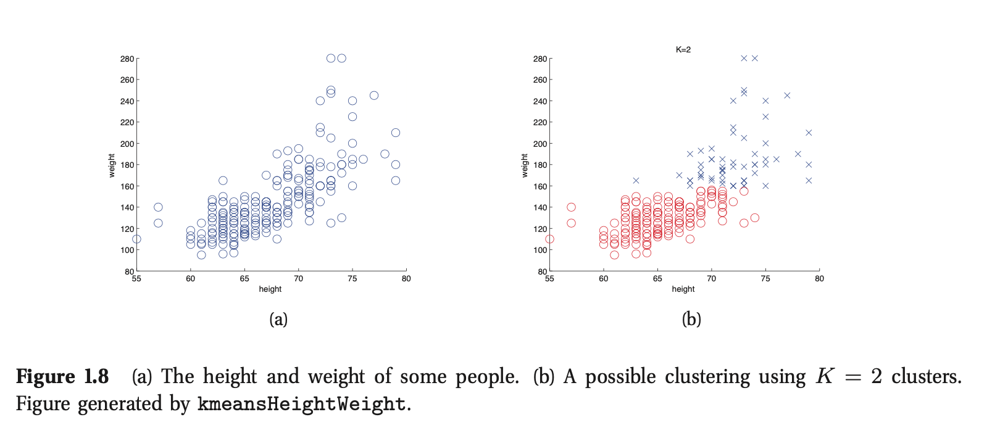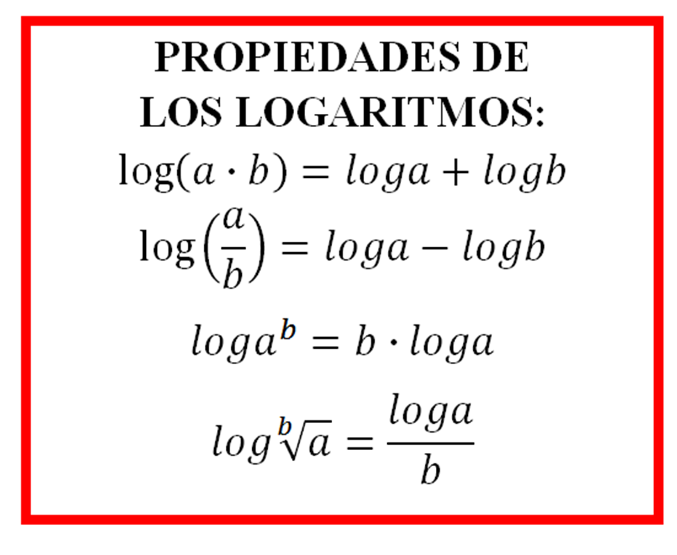

### Descubriendo variables (o factores latentes)


* Útil cuando los datos son de dimensiones muy altas.

* Es útil para conocer el subconjunto de variables de un vector de características que conservan la máxima información. (Podemos reconstruir la información a partir de información *clave*)

* Se proyectan en un espacio de dimensión reducida $M: R^m \rightarrow R^{n}$

* Por lo regular  2 <= n <=3 para poder analizar los datos visualmente.

* Util para compresión de imágenes o aplicar algoritmos de agrupamiento.

* Uno de los métodos mas utilizados es análisis de componentes principales o PCA.

* 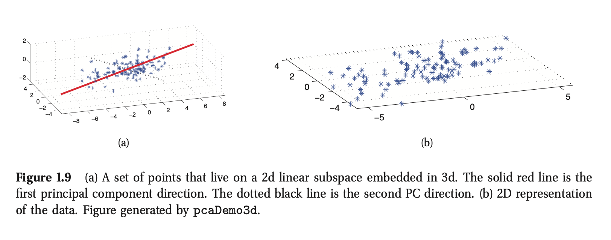

  

  


## Explicaciones conceptuales 

### Modelos paramétricos y no paramétricos

**Modelos paramétricos**. 

* Son modelos que tienen un número fijo de parámetros independientemente de la cantidad de datos. 
* Requiere un conocimiento sobre el fenómeno mas detallado.
* Se apoya de suposiciones fuertes sobre los datos. (e.g. Datos distribuidos con cierta función de probabilidad)
* Funciona bien con pocos datos.
* No sufren de **sobre-ajuste**.

Ejemplos  

1. Regresión lineal.
2. Estimación de distribuciones de probabilidad.    

 **Modelos No-paramétricos**: 

* Los parámetros crecen con los datos.

* Se requiere un conocimiento menos profundo sobre el fenómeno.

* No requiere hacer suposiciones fuertes sobre los datos. 

* Requiere muchos datos para tener buen desempeño

* Sufren de sobre-ajuste 

  

  **Ejemplos:**

  Redes neuronales (Supervisado)
  
  Redes neuronales convolucionales (Supervisado)
  
  $k$-vecinos cercanos (Supervisado)
  
  PCA (no-supervisado)
  
  Mapas auto-organizados (No paramétricos - No supervisados)
  
  


Ademas de los modelos de clasifiación mencionados existen otros modelos clasificadores que también son de importancia en este curso

* Mínima distancia
* Modelo del Paralelepípedo
* Árboles de clasificación
* Clasificación por máxima verosimilitud

### Ejemplos de Modelos paramétricos para clasificación.

**Clasificador Lineal**

Un clasificador lineal es una función de la forma 

$$y = f( \mathbf{w}^T\mathbf{x} + b)$$

donde , $\mathbf{w}$ es un vector de pesos, $\mathbf{x}$ es el vector de entrada y la función $f$ convierte el producto interno de los dos vectores en una salida. 

la función $f$ toma valor de:

* 1: si $\mathbf{w}^T\mathbf{x}+b > 0$, y
*  $0$: de otra manera.

Para el problema de clasificación de dos clases, el problema puede interpretarse como un hiperplano que divide el espacio de vectores de entrada $x$, en dos. Donde los valores que quedan de un lado del hiperplano son clasificados como positivos y lo que quedan debajo negativos


**Regresión Logística**

Es una generalización de la regresión lineal para clasificación binaria.

La respuesta o salida $y$ de la función responde a una distribución de probabilidad de Bernoulli. 

$$p(y|\mathbf{x,w}) = Ber (y| \mu(x)$$)

 donde la respuesta toma dos valores: $y\in\{0,1\}$. y $\mu(\mathbf{x}) = p(y=1|x)$  es la probabilidad de éxito dada una entrada $\mathbf{x}$.

La función de distribución de probabilidad está dada por la función sigmoide:

$$\mu(\mathbf{x})=\frac{1}{1+exp(\eta)}$$ 

Acoplando  los términos en orden obtenemos la **regresión logística**

$$p(y|\mathbf{x,w}) = Ber(y|sigm(\mathbf{w^Tx}))$$

La distribución de probabilidad de Bernoulli es discreta y dicotómica que calcula la probabilidad de éxito. 

Ejemplo:

$$p(y_i=1|x_i,\mathbf{w}) = sigm(w_0+w_1x_i) $$

es aplicado a definir si un estudiante pasa la prueba ($y=1$) o no ($y=0$) de acuerdo a su puntuación.

Para esto a partir de los datos ($x_i$,$y_i$), donde $x\in R$ es la calificación o puntaje representado por el eje horizontal, y $y\in{0,1}$ (pasa o aprueba la clase), representado por el eje vertical. 

Los puntos negros son los datos reales.

Los rojos son salidas estimadas $p(y=1|\mathbf{x}_i,\hat{\mathbf{w}})$

Si el umbral es mayor a 0.5 entonces la salida estimada será $\hat{y}(x) = p(y=1|\mathbf{x})>0.5 = 1$ 

 


### Ejemplo de modelo no paramétrico

**$k$ vecinos cercanos**

Este algoritmo consiste en buscar aquellos datos cercanos a un *dato de prueba* dado un radio $r$ o tamaño de vecindad $K$. Y regresa la proporción de clases encontradas. 

Este algoritmo puede expresarse como

$$p(y=c|\mathbf{x},D,K)=\frac{1}{K} \sum_{i\in N_k (\mathbf{x},D)} I(y_i=c)$$

Donde $N_k(\mathbf{x},D)$ son los índices pertenecientes al vecindario.

$I(e)$ es la función indicadora que devuelve $1$ si $e$ es verdadero y $0$ en caso contrario.

con $K=1$ se genera un diagrama de Voronoi. 

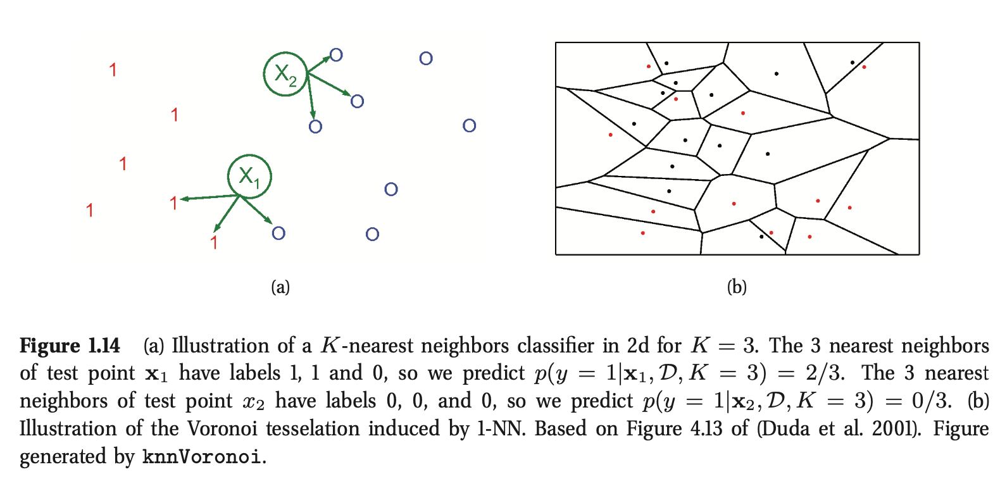


1) Datos sintéticos de 3 clases

2) Probabilidad de cada punto de pertenecer  a clase 1 con k=10 vecinos cercanos.

3) Probabilidad de cada punto de pertenecer  a clase 2 con k=10 vecinos cercanos.

4) Áreas de cada clase construidas con los mismos datos. Estas representan la clase con mas probabilidad de pertenecer a un dato $\mathbf{x}$ . Se puede expresar como: $\hat{y}=argmax_c(y=c|\mathbf{x},D)$


### Maldición de la dimensionalidad.

Se refiere a la incapacidad o el mal desempeño de los modelos de aprendizaje automático de poder escalar con los datos debido a la alta dimensionalidad del problema. 


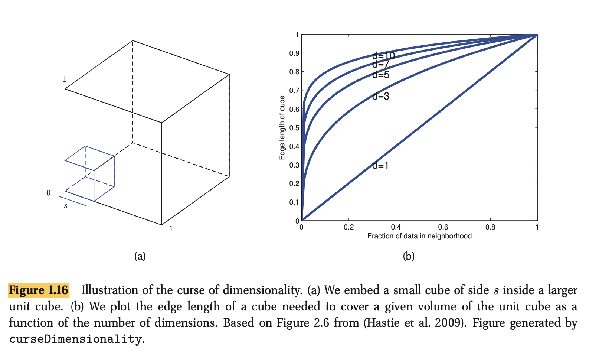

En el caso de vecinos cercanos, la distancia para obtener una vecindad mínima crece exponencialmente con el número de dimensiones. 

En optimización el espacio de búsqueda crece exponencialmente con el número de dimensiones del espacio.

## Etapas del proceso de clasificación (miércoles 3 marzo)

0. Definir el problema de clasificación (o regresión).
   1. Clasificar Flores
   2. Clasificación de Hongos (Comestibles o no comestibles)
   3. Diagnosticar Cancer. 
1. Colectar la mayor cantidad de datos posible con la mejor calidad.  Ordenarlos en una tabla ( como .csv)
2. Preparar los datos.
   1. Aleatorizar los datos para que el orden entre ellos no afecte en el entrenamiento del modelo.
   2. Hacer un análisis exploratorio de los datos para detectar características generales de las correlaciones, variables de interés, balance de clases, formas generales de las distribuciones.
   3. Reducir la dimensionalidad de ser posible.
   4. Definir el conjunto de entrenamiento y prueba.
3. Entrenar y probar varios modelos bajo las mismas condiciones.
4. **Seleccionar el modelo**
5. En caso de no tener resultados satisfactorios, ajustar parámetros o incluir nuevos modelos.
6. Predicción, clasificación o inferencia (Se puede hacer sobre un conjunto de datos de validación).
7. Interpretar el modelo.


### **Selección de modelo**

Cuando tenemos una variedad de modelos, existe la necesidad de seleccionar el mejor.

Para esto se requiere calcular un **error generalizado**, el cual es el error esperado de la tasa de clasificaciones incorrectas de los datos futuros o no observados.

Para esto es necesario organizar los datos en 1 o mas particiones, donde cada partición estará compuesto de un conjunto de datos de entrenamiento, y el restante de prueba (Fig 1.21). 

Una manera de validar el modelo es el siguiente:

0. Seleccionar el modelo de clasificación

1. Particionar los datos en al menos dos conjuntos para ajustar o entrenar un modelo: 

   1. Entrenamiento 
   2. Prueba

2. Para la partición: entrenar un modelo con el conjunto de entrenamiento y probar su ajuste con con el conjunto de Prueba.

3. Medir el error primero con el conjunto de entrenamiento y prueba. El error se puede expresar como:

   $$err(f,D) = \frac{1}{N} \sum_{i=1}^N I (f(\mathbf{x}_{i}) \neq y_i)$$

4. (Opcional pero recomendado) Repetir el procedimiento varias veces seleccionando  los conjuntos de manera diferente.

   

El error generalizado se expresa como el error promedio de un conjunto de datos de varias particiones diferentes dado por.

$$\textit{error general} = \frac{1}{M} \sum^M_{i=1} err_i(f,D)$$

Donde *M* es el número de particiones diferentes.

En cada partición, el conjunto de entrenamiento es utilizado para ajustar parámetro del modelo, y el conjunto de prueba para calcular el error y evitar seleccionar un modelo **sobre ajustado**.

Este error puede ser aproximado utilizando un conjunto de datos de prueba. 

 Ejemplo de Validación Cruzada con un ejemplo de k vecinos cercanos.


Adicionalmente es posible reservar un 3er conjunto exclusivo llamado **conjunto de validación**. El cual es utilizado para corroborar la generalización del modelo. Los Datos de este conjunto de validación pueden mantenerse invariantes.

### Sobre ajuste

Es un problema que sufren principalmente los modelos pertenecientes a aprendizaje automático. Un ajuste *perfecto* sobre el conjunto de entrenamiento impide desempeñarse de manera adecuada con cualquier otro dato que no haya sido contemplado en su entrenamiento. **Esto se detecta cuando tenemos un error de ajuste muy bajo en el conjunto de prueba y un error muy alto en el conjunto de entrenamiento.**

### No Free Lunch Theorem

Se refiere a la no existencia de modelos Universales.

*Todos los modelos están mal pero algunos son útiles*. George Box (Box and Draper 1987)

Aunque probemos nuestro modelo y lo validemos con los métodos adecuados para obtener cierta capacidad de generalización en cierto dominio de aplicación, este se desempeñara pobre en otros dominios diferentes.

**Tarea 3** Experimento validación cruzada

Replicar el ejemplo de la figura 1.21 pero con diferente conjunto de datos. Estos pueden ser sintéticos, o descargados de alguna base de datos. 

Dudas:

​	1) 

Trabajar con vectores bidimensionales para poderlos graficar y observar sin dificultad en un plano 2-d.

Hacer validación cruzada. con al menos 2-iteraciones  (2-fold validation).

Como producto generar una figura parecida a 1.15(d), 1.21 (a). e identificar con que parámetro existe sobre ajuste, y sub-ajuste. 

Dudas por correo electrónico rdglpz@gmail.com o en clase

Entrega para el viernes 12 Marzo

Se pueden apoyar del siguiente código en Python: 

https://www.aprendemachinelearning.com/7-pasos-machine-learning-construir-maquina/

https://scikit-learn.org/stable/auto_examples/neighbors/plot_classification.html#sphx-glr-auto-examples-neighbors-plot-classification-py

https://en.wikipedia.org/wiki/Cross-validation_(statistics)#/media/File:K-fold_cross_validation_EN.svg

# Unidad 2 Interpretación Geométrica de la Clasificación 

Viernes 5 de Marzo

Notas: Correcciones y aclaraciones en la notación están escritas con un * con respecto a la última versión.

La regresión logística es un modelo estadístico que utiliza una **función sigmoidal** para modelar variables dependientes binarias. 

En términos geométricos, regresión logística trata de encontrar un plano que separe las clases **minimizando el error de clasificación**. 

Trabaja con conjunto de datos (dataset) casi separables.

Para clasificación binaria, si un hiperplano puede separar razonablemente bien dos clases, entonces se dice que el conjunto de datos es **linealmente separable**.

### Derivación de la interpretación geométrica

Ejemplo:

Imaginemos que tenemos un conjunto de datos  $D\in\{x_i,y_i\}_{i=1}^N$ donde $y_i\in \{0,1\}$ y $x_i \in R^{Dim}$ 

 Para este conjunto de datos necesitamos una función (lineal) que nos ayude a separar los datos en dos clases. 

Para esto recurriremos a la ecuación general de la recta que separa dos clases:

$ax+by+c=0$

donde en aprendizaje automático para un hiperplano cualquiera se escribe como:

$$\mathbf{w}^T\mathbf{x}_i + w_0 = 0$$,

y queremos encontrar los mejores parámetros $\mathbf{w}$. que nos ayuden a **maximizar la precisión** (minimizando el error)  de la clasificación en el conjunto de datos $D$

Si la línea pasa sobre el origen del hiperplano entonces el intercepto $w_0 = 0$

Problema:

Dado un conjunto $D\in\{x_i,y_i\}_{i=1}^N$ donde la respuesta esta dada por una variable binaria  $y_i\in \{-1,1\}$ (*) y  la variable independiente es  $x_i \in R^{dim}$, encontrar un hiperplano que pueda separar ambas clases de tal manera que también pueda clasificar correctamente nuevos datos. 


Ejemplo "hiperplano" bidimensional

. 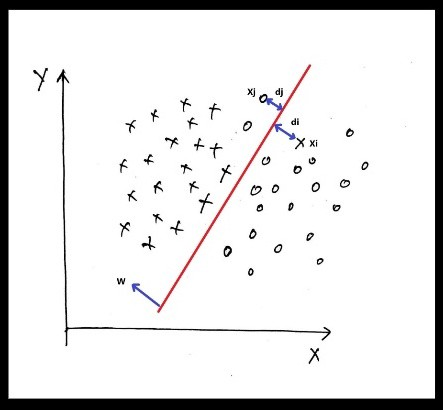

Los pesos $\mathbf{w}$ se representan geométricamente en un plano como un punto $P=({w_1},{w_2})$, el cual a su vez es la terminación un vector con dirección ortogonal a la frontera de decisión.

Ejemplo *: Si la frontera de decisión esta dada por la recta. 

$m_f w_1= w_2$

$(m_fw_1-w_2=0)$

Ejemplo:  Si  $m_f=2$ (pendiente de la frontera) entonces:

$2w_1=w_2$.

La pendiente ortogonal correspondiente esta dado por

$m_o w_1 =w_1 $

donde $m_o=-1/2$

$-1/2w_1 = w_2$

Porque en el plano bidimensional se cumple que

 $m_f m_o = -1$

$\frac{2}{1}\cdot-\frac{1}{2}= -1 $ 


**Ejercicio:** Si tenemos pesos $w_1 = 2$, y $w_2 = 3$ en el punto $P=(w_1,w_2)$. Cuál sería la pendiente de la frontera de decisión?

**Ejercicio:** Si tenemos pesos $w_1 = 2$, y $w_2 = 3$ e intercepto b=2. Cuál sería la **recta** de la frontera de decisión?


Para probar a que clase pertenece un punto $x_i$ es necesario acordarnos de la fórmula para medir la distancia  mas cercana de un punto $x_i$ a la recta. 

(Distancia Sin intercepto)

$$d_i = \frac{\mathbf{w}^T \mathbf{x_i}} {||\mathbf{w}||}$$

(Distancia con intercepto)

$$d_i = \frac{\mathbf{w}^T \mathbf{x_i} +w_0} {||\mathbf{w}||}$$

donde $\mathbf{||w||} = (\sum_{i=1}^{Dim}w_i^{2}) ^{1/2} $ **es la magnitud o módulo del vector**. * (Aclaración en la definición)

Por lo tanto si $d_i$>0 entonces $x_i$ pertenece a la clase positiva.

Una primera formulación intuitiva de la función objetivo  es la siguiente:

$$\hat{\mathbf{w}} = argmax_{\mathbf{w}} \sum_{i-1}^N (y_i \cdot (\mathbf{w}^T \mathbf{x}_i+w_0)) $$  


Esta función estará sumando valores positivos siempre y cuando se cumpla $sign(\mathbf{w}^T \mathbf{x}_i+w_0) = sign(y_i)$

Problema de esta formulación: Es sensible a los  datos atípicos (outliers).

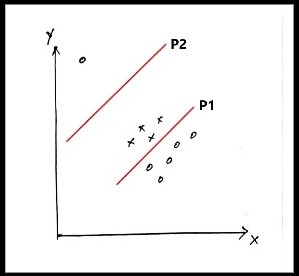

Solución: Usar una función que  mapea $ f:y_i \cdot(\mathbf{w}^Tx_i + w_0)\rightarrow \{0,1\}$ *


$$sigm(z) = \frac{1}{1+exp(-z)}$$

Ejemplo funciones sigmoidales con dos parámetros.

Esta función regresa valores entre 0.5 y 1 cuando $y_i(\mathbf{w}^T \mathbf{x}_i + w_0)>0$*

Esta función regresa valores entre (0, 0.5) en caso contrario.

Por lo tanto la nueva formulación se expresa como

$$\hat{\mathbf{w}}, \hat{w_0} = argmax_{\mathbf{w},w_0} (\sum sigm (y_i \cdot (\mathbf{w}^T x_i+w_0)))$$

Problema: Tiene poca estabilidad numérica debido a los parámetros (variables) $\mathbf{w}$ en el exponente en el denominador. 

Solución: Aplicar logaritmo.

$$\hat{\mathbf{w}}, \hat{w_0} = argmax_{\mathbf{w},w_0} (\sum log (\frac{1}{1+exp(-y_i \cdot (\mathbf{w}^T x_i+w_0)})$$

(paso intermedio, completar por ustedes mismos)

$$\hat{\mathbf{w}}, \hat{w_0} = argmax_{\mathbf{w},w_0} (\sum -log (1 + exp(-y_i \cdot (\mathbf{w}^T x_i+w_0))$$

Último paso, convertirlo en un problema de minimización.

(Completar ustedes mismos)


**Utilizando la ecuación del hiperplano $ax+by+cz+d=0$ para resolver la frontera de decisión de un clasificador lineal **


**Ecuación General del hiperplano**

$ax+by+cz+d=0$

*nota: hiperplano o plano se utilizan en este apartado indistintamente*

Dada una dirección en R$^{Dim}$,  con $Dim>1$, hay infinitos hiperplanos perpendiculares. Si se conoce un punto un inicial $P_0$ de un hiperplano perpendicular a la dirección en R$^{Dim}$, entonces este queda definido.

Como formular la ecuación del plano $\pi$ que pasa por el origen con coordenadas $P_0$ y es perpendicular al vector $\mathbf{w} = [w_1,w_2,w_3]^T$? 

*Esta ecuación del plano  es la frontera de decisión de nuestro clasificador*.

$\mathbf{w}^T \mathbf{x} = 0$

Dado un punto $P_0 = \mathbf{x}^0 = [x_1^0,x_2^0,x_3^0] = [0,0,0]$ que es el  punto que pasa por el origen, y el vector $\mathbf{w}$ encontrar la ecuación del hiperplano.

Para construir un hiperplano se requiere otro punto $P$ que forma parte del hiperplano y expresa como $P \in \pi$, donde $P= \mathbf{x} = [x_1,x_2,x_3]$ no lo conocemos pero  satisface el producto interno:

 $\overrightarrow {P_0P} \cdot \overrightarrow{\mathbf{w}}=0$

$\overrightarrow {P_0P} = [(x_1-x^0_1),(x_2-x_2^0),(x_3-x_3^0)] $

$[(x_1-x^0_1),(x_2-x_2^0),(x_3-x_3^0)] \cdot (w_1,w_2,w_3) = 0 $

agrupando términos

$w_1(x_1-x_1^0),w_2(x_2-x_2^0),w_3(x_3-x_3^0) = 0$

$w_1x_1 + w_2x_2 + w_3x_3 + (-w_1x_1^0 -w_2x_2^0-w_3x_3^0) = 0$

Si sustituimos $\mathbf{w}=[1,1]$ 

$1*x_1+1*x_2 + 0 = 0$

donde: $d= (-w_1x_1^0 -w_2x_2^0-w_3x_3^0) $

por lo tanto la ecuación general del plano es:

$w_1x_1 + w_2x_2 + w_3x_3 + d = 0$


Ejercicio (1.a). En una dimensión $Dim = 2$. Encontrar la ecuación del plano $\pi$ que pasa por las coordenadas $P_{0} = [0,0]$ y es la frontera de decisión de un clasificador lineal con pesos $\mathbf{w}=[1,2]$.

Respuesta:

paso 1. Sustituir valores en la ecuación de la recta $w_1x_1 + w_2x_2 + (-w_1^0x_1 -w_2x_2^0) = 0$

paso 2. Simplificar.

1.b Dibujar la frontera de decisión en el plano.

$w_1 x_1 +w_2x_2 = 0$

$w_1 x_1 / w_2 = x_2$

(se hace despejando la variable dependiente, en este caso $x_2$)

1.c  Igual que el ejercicio 1.a pero ahora $P_0=[0,2]$

$w_1x_1 + w_2x_2 + w_3x_3 + (-w_1x_1^0 -w_2x_2^0-w_3x_3^0) = 0$

$1*x_1+2*x_2 + (-1*0-2*2) = 0$

$d = 0-4 = -4$

$1*x_1+2*x_2 -4 = 0$

$1*x_1-4 = -2*x_2 $

$(x_1-4)/-2 = x_2$


1.d Extra. Extender el ejercicio (1.a) a 3 dimensiones ( $Dim =3$), con  $P_0 = [0,0,0]$ y $\mathbf{w}=[2,3,4]$


**Referencias**

https://aga.frba.utn.edu.ar/blog/2016/09/08/ecuaciones-del-plano/

*Machine Learning: a Probabilistic Perspective*. by Kevin Patrick Murphy. MIT Press, 2012.

https://towardsdatascience.com/geometric-interpretation-of-logistic-regression-4f85047a5860

https://mathinsight.org/distance_point_plane_examples

https://quimicayalgomas.com/wp-content/uploads/2015/03/logaritmos-propiedades.png

## Unidad 3 Clasificación No supervisada

Miércoles 10 de Marzo

La clasificación no supervisada (CNS) forma parte de aprendizaje no supervisado (ANS). 

El ANS consiste en extraer información de una distribución sin requerir la intervención de un experto para modelar o marcar datos. 

Una tarea clásica de ANS es encontrar la mejor representación de los datos con modelos simples para que preserven la máxima información posible.

Dentro del ANS encontramos esta clasificación no excluyente de diferentes técnicas.

1. Representación en bajas dimensiones
2. Representaciones independientes.
3. Representaciones dispersas.

Los algoritmos de  CNS se apoyan de una o de este tipo de representaciones.

### Definición y formulación matemática.


Un problema de clasificación no supervisada, es determinar el mejor número de clases que existe en un conjunto de datos.

Una manera de medirlo es utilizando el Coeficiente de la Silueta 

Este es un método para validar la coherencia en el análisis de grupos.

El coeficiente de silueta mide la cohesión: que tan similar es un objeto $x_i$ a su propio grupo. A cada $x_i$ se le asocia una calificación que va entre $-1,1$. Valores cercanos a 1 indican que la clasificación es consistente, y lo contrario indica que puede existir poca consistencia (clases traslapadas no separadas).

#### Definición:

Partimos de un conjunto de datos clasificados de alguna manera en $k$ grupos (clusters), donde el coeficiente silueta esta dado por: 

$s(i) = \frac{b(i)-a(i)}{max\{a(i),b(i)\}} ,  \text{ si } |C_i|>1$

$s(i)=0,\text{ si } |C_i| = 1$

$-1 < s(i) < +1$

donde 

$a(i) = \frac{1}{|C_i|-1}\sum_{j\in C_i, i \neq j} d(i,j)$

Es la distancia promedio entre el objeto $i$ y los demás vectores en su grupo (clúster) $C_i$. Se interpreta como una *calificación de integración* del dato $i$ a su grupo $C_i$y buscamos el menor valor.

$b(i) = \text{min}_{k \neq i} \frac{1}{|C_k|} \sum_{j\in C_k } d(i,j)$

es la diferencia media del punto $i$ a algún grupo $C$


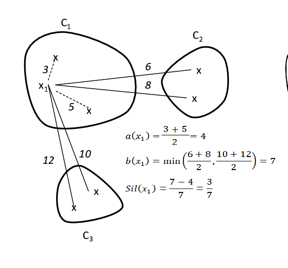

 

Ejemplo Interactivo en Notebook Python https://scikit-learn.org/stable/auto_examples/cluster/plot_kmeans_silhouette_analysis.html

**Un algoritmo de agrupamiento:  k-medias**

Es una variante al algoritmo EM (Expectation - Maximization) que asume que los grupos son compactos con distribuciones gaussianas con una covarianza  fija $\sigma^2 I_D$ , y misma importancia $1/K$ para cada grupo, donde $K$ es el número de grupos. 

Estas suposiciones simplifican el problema y nos permite enfocarnos en encontrar los centroides de los grupos $\mu_k\in R^{Dim}$

Paso *Expectation*

$p(z_ik|\mathbf{x}_i,\theta ) \sim \mathbf{I}(k=z_i^*)  $

donde $z_i^* = argmax_k p(z_i=k|\mathbf{x}_i,\theta)$

El grupo mas probable de pertenencia se calcula con:

$z_i^* = \text{arg min}_k ||\mathbf{x_i}-\mathbf{\mu}_k||_2^2$

Paso *Maximization*

$\mathbf{\mu}_k = \frac{1}{N_k}\sum_{\mathbf{x}_i\in C_{z_i}, z_i = k} \mathbf{x}_i$

Dónde  $z_i = k$

Algoritmo:


**Otro algoritmo de agrupamiento: agrupamiento jerárquico**	

Es un algoritmo agrupamientos de manera anidada. 

Hay dos enfoques heurísticos.

1. Enfoque aglomerativo (abajo hacia arriba, *botton - up*)
   1. Enlace sencillo (nearest neighbor clustering).
      1. $d_{SL}(G,H) = min_{i \in G, i'\in H} d(i,i')$
   2. Enlace completo
      1. $d_{CL}(G,H) = max_{i \in G, i'\in H} d(i,i')$
   3. Enlace promedio.
      1. $d_{avg}(G,H)=\frac{1}{n_g n_H}\sum_{i\in G,i' \in H}d(i,i')$
2. Enfoque divisivo. (De arriba hacia abajo, *top-down*)
   1. K-means bisectiva 
   2. Análisis de disimilaridad. 
      1. Los vectores mas diferentes se van sacando del grupo principal G a H.
      2. 

Trabajan con una matriz de  distancias llamada **matriz de disimilaridad**.


Ejemplo de la página del Software STAT555 https://online.stat.psu.edu/stat555/node/86/

Es complicado definir formalmente una calidad para medir el mejor agrupamiento pero siempre regresan una solución.


Este es un método para validar la coherencia en el análisis de grupos.

El coeficiente de silueta mide la cohesión: que tan similar es un objeto $x_i$ a su propio grupo. A cada $x_i$ se le asocia una calificación que va entre $-1,1$. Valores cercanos a 1 indican que la clasificación es consistente, y lo contrario indica que puede existir poca consistencia (clases traslapadas no separadas).


#### Definición:

Partimos de un conjunto de datos clasificados de alguna manera en $k$ grupos (clusters), donde el coeficiente silueta esta dado por: 

$s(i) = \frac{b(i)-a(i)}{max\{a(i),b(i)\}} ,  \text{ si } |C_i|>1$

$s(i)=0,\text{ si } |C_i| = 1$

$-1 < s(i) < +1$

donde $

$a(i) = \frac{1}{|C_i|-1}\sum_{j\in C_i, i \neq j} d(i,j)$

Es la distancia promedio entre el objeto $i$ y los demás vectores en su grupo (clúster) $C_i$. Se interpreta como una *calificación de integración* del dato $i$ a su grupo $C_i$y buscamos el menor valor.

$b(i) = \text{min}_{k \neq i} \frac{1}{|C_k|} \sum_{j\in C_k } d(i,j)$

es la mínima diferencia media del punto $i$ a algún grupo $C$


Fuente: Best Clustering Configuration Metrics: Towards Multiagent Based Clustering,Conference: Advanced Data Mining and Applications - 6th International Conference, ADMA 2010, Chongqing, China, November 19-21, 2010, Proceedings, Part I. 

Ejemplo Interactivo en Notebook Python https://scikit-learn.org/stable/auto_examples/cluster/plot_kmeans_silhouette_analysis.html 

**Un algoritmo de agrupamiento:  k-medias**

Es una variante al algoritmo EM (Expectation - Maximization) que asume que los grupos son compactos con distribuciones gaussianas con una covarianza  fija $\sigma^2 I_D$ , y misma importancia $1/K$ para cada grupo, donde $K$ es el número de grupos. 

Estas suposiciones simplifican el problema y nos permite enfocarnos en encontrar los centroides de los grupos $\mu_k\in R^{Dim}$

Paso *Expectation*

$p(z_i=k|\mathbf{x}_i,\theta ) \sim \mathbf{I}(k=z_i^*)  $

donde $z_i^* = argmax_k p(z_i=k|\mathbf{x}_i,\theta)$

El grupo mas probable de pertenencia se calcula con:

$z_i^* = \text{arg min}_k ||\mathbf{x_i}-\mathbf{\mu}_k||_2^2$

Paso *Maximization*

$\mathbf{\mu}_k = \frac{1}{N_k}\sum_{\mathbf{}_{i: z_i = k}} \mathbf{x}_i$

Dónde  $z_i = k$

Algoritmo:


**Otro algoritmo de agrupamiento: agrupamiento jerárquico**	

Es un algoritmo de agrupamiento anidado anidada. 

Hay dos enfoques heurísticos.

1. Enfoque aglomerativo (abajo hacia arriba, *botton - up*)
   1. Enlace sencillo (nearest neighbor clustering).
      1. $d_{SL}(G,H) = min_{i \in G, i'\in H} d(i,i')$
   2. Enlace completo
      1. $d_{CL}(G,H) = max_{i \in G, i'\in H} d(i,i')$
   3. Enlace promedio.
      1. $d_{avg}(G,H)=\frac{1}{n_g n_H}\sum_{i\in G,i' \in H}d(i,i')$
2. Enfoque divisivo. (De arriba hacia abajo, *top-down*). Comienza con todos los datos en con un grupo que agrupa a todos los datos, y recursivamente se va dividiendo en dos (teniendo $2^{N-1}-1$ maneras de dividir un grupo de $N$ grupos en 2 grupos, es difícil de calcular el partido óptimo). 
   1. K-means bisectiva.  
   2. Arbol de expansión mínimo con el grafo de disimilaridad y hacer nuevos grupos rompiendo el link correspondiente a la mas larga disimilaridad.(El resultado es equivalente  a agrupamiento aglomerativo con enlace sencillo.)
   3. Análisis de disimilaridad. 
      1. Se comienza con un grupo o clúster $G = \{1,\dots,N\}$ que contiene todos los datos. y después medimos la disimilaridad promedio de $i\in G$ a otros $i' \in G$ con la formula 
         1. $d_i^G  = \frac{1}{n_G}\sum_{i' \in G}d_{i,i'}$
      2. Los vectores mas diferentes se van sacando del grupo principal G a H.
         1. $i^* = \text{arg max}_{i \in G} d_i^G, G = G / \{i*\}, H = \{i^*\} $
      3. Se mueven los datos de $G$ a $H$ hasta que un criterio es alcanzado. En otras palabras tomamos un dato $i^*$ para mover que **maximiza la disimilaridad promedio** para cada $i' \in G$ pero **minimiza la disimilaridad promedio** a cada $i' \in H$.
         1. $d_i^H \frac{1}{n_H} \sum_{i'\in H} d_{i,i'}, i^* = \text{arg max }_{i \in G} \text{ } d_i^G-d_i^H$
      4. El resultado es un grupo  $G$ dividido en dos.

Trabajan con una matriz de  distancias llamada **matriz de disimilaridad**.


Ejemplo de la página del Software STAT555 https://online.stat.psu.edu/stat555/node/86/

Es complicado definir formalmente una calidad para medir el mejor agrupamiento pero siempre regresan una solución.


https://scikit-learn.org/stable/auto_examples/cluster/plot_agglomerative_dendrogram.html

## Examen Unidad 1,2 y 3

Viernes 12 de Marzo


asdfasdfasdfasdf


