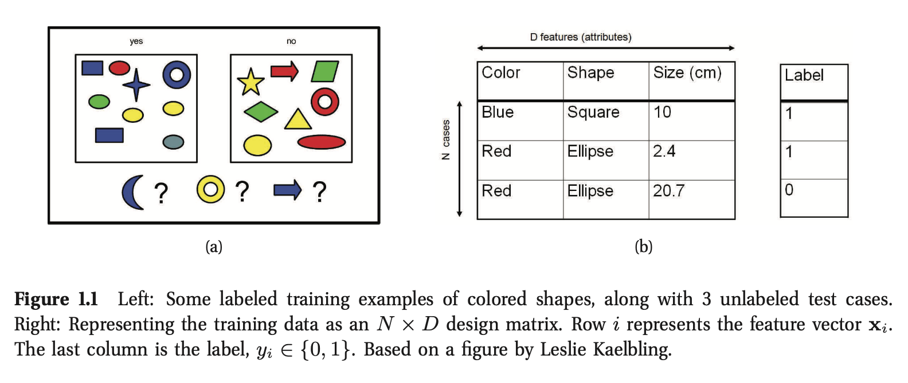

# Unidad 5: Adjudicación de pixeles a clases. Técnicas no estadísticas 

## 5.1 Árboles de clasificación. (pág 544 ML a probabilistic perspective)


Los modelos de árboles de clasificación y regresión (*Classification and regresion trees models: CART models*), son llamados también árboles de decisión. 

Estos árboles definen un particionamiento de regiones en el  espacio. En donde en cada región se define un modelo local asociado al espacio (de datos) de entrada.

**Conceptos Básicos**

De manera general un arbol de clasificación trabaja haciendo divisiones paralelas en los ejes para particionar un espacion en $M$ regiones definidas por $\mathbf{v}_m$. (Fig 16.1).


Este espacio puede asociarse a la respuesta promedio de cada una de esas regiones dando como resultado una superficie constante por partes (piecewise constant surface). 

$f(\mathbf{x})=E[y|\mathbf{x}]=\sum_{m=1}^M w_m I(\mathbf{x}\in R_m)=\sum_{m=1}^Mw_m \phi(\mathbf{x};\mathbf{v}_m))$


Para crear un árbol de regresión los pasos generale son los siguientes: 

1. Dividir el espacio predictor en $M$ regiones no sobrepuestas (Fig. 16.1 (b)). 
2. Por cada observación $\mathbf{x}_i$, que cae en una región $m$, se predice con la respuesta promedio $w_m$ asociada a esa región.


Un ejemplo de otro ejercicio claro se encuentra en https://fhernanb.github.io/libro_mod_pred/arb-de-regre.html.

**¿Si queremos hacer clasificación en vez de regresión, que hacemos?**

En vez de calcular el valor de la respuesta promedio, guardamos la distribución del número de datos pertenecientes a cada clase  en cada hoja del árbol como el ejemplo siguiente. Recordemos el ejemplo de la clasificación de objetos de la Fig. 1.1, y como resolvería el problema de clasificación un árbol de clasificación.





**Construyendo el árbol de clasificación:**

Encontrar el particionamiento óptimo es NP-completo (Hyafil y Rivest 1976), por lo tanto es común utilizar un procedimiento glotón (greedy).

El objetivo es encontrar una función de división que escoja la mejor característica y el mejor umbral como describe la ecuación:

$(j*,t*) = \text{arg } \underset {j\in \{1,\dots,D \} }{min} \underset{t\in T_j}{\text{ min}} \text{ cost }(\mathbf{x}_i,y_i:x_{ij}\le t) + \text{ cost }(\mathbf{x}_i,y_i:x_{ij}> t) $


```
X

i   X     Y={1,0}
0 (1,0) - 1
1 (1,1) - 1
2 (0,0) - 0
3 (0,1) - 0

------

Para:
t = {0,1}
j = 2
t = 0

Partición (División) 0
0 (1,0) - |1-0|
2 (0,0) - |0-0|

Particion (División) 1
------------
1 (1,1) - 1 |1-1|
3 (0,1) - 0 |0-1| 

Costo: 2 equivocaciones

Para: 
t = {0,1}
j = 1
t = 0

Particion (División) 0 
2 (0,0) - 0 |0-0|=0
3 (0,1) - 0 |0-0|=0

Partición (División)  1
0 (1,0) - 1 |1-1|=0
1 (1,1) - 1 |1-1|=0

Costo: 
0 equivocaciones

```


Donde la función de costo "cost" mide el error de clasificación.

$j$: es la característa del vector $\mathbf{x}_i$

$T_j$ son los posibles umbrales


Para ejemplificar la construcción, asumimos que las entradas son números reales y la seleccion de $j$ y $T_j$ se hace de la siguinente manera.

El conjunto de posibles umbrales $T_j$ para característica $j$ pueden ser obtenidas ordenando los vectores u objetos de entrada $\mathbf{x}_i=\{x_{i,0}, x_{i,1},...x_{i,j},\dots, x_{i,M}\}$ por su característica $j$.

En el caso de entradas categóricas, se generan divisiones de la forma $x_{ij} = c_k$ y $x_{i,j} \neq c_k$ para cada etiqueta.


Si el árbol crece demasiado, o dejamos que tenga mucha granularidad (cada hoja tenga pocos o un solo elemento en $D_L$ o $D_R$), puede producir un sobre ajuste.

Por lo tanto existen mecanismos para regular este hecho.

1. El árbol excede un número máximo de profundidad.
2. La distribucion de la respuesta en $D_L$ o $D_R$ es suficientemente homogéneo o es puro.
3. El número de datos es pequeño en las hojas.
4. Poca ganancia en el costo:	

   $\Delta = cost(D)-(\frac{D_L}{D}cost(D_L) + \frac{|D_R|}{|D|}cost(D_R))$


Costo de la clasificación:


Existen varios manera de medir la calidad de la división. Estas estan basadas en un modelo Bernoulli multinomial, que expresa la probabilidad condicionada a la clase de datos que satisfacen $X_j<t$. 

$\hat{\pi}_c = \frac{1}{|D|}\sum_{i\in D} I (y_i=c)$

D: es el conjunto de datos (dataset) en la hoja. 

$y_i=c$, es el elemento $y_i$ satiface la desigualdad $X_j<t$ y la sumatoria es al proporción de datos clasificados en $c$ dado un (sub) conjunto de datos $D$.

Una funcón de costo utilizada para evaluar divisiones en el conjunto de datos es el **índice Gini**


$\sum_{c=1}^C \hat{\pi}_c(1-\hat{\pi}_c) = 1 - \sum_{c}\hat{\pi}^2_c$


El índice Gini nos dice que tan bien las clases estan separadas por dos grupos dada un parámetro o umbral de separación. 

Como mencionamos antes,  para dividir patrones de entrenamiento en dos grupos requerimos.: 

​	La selección de atributo o característica $j$ y un valor de ese atributo $t$.

La mejor separación tendría un índice de 0 y la peor 0.5.


Otros costos son

* Tasa de error de clasificación (Missclassification rate),
* Minimización de Entropía (equivalene a máximizar la ganancia del error).


https://grass.osgeo.org/grass78/manuals/addons/r.learn.ml.

### 5.2 Clasificación por mínima distancia (el mas sencillo de todos).

### 5.3 Clasificación por paralelepípedos. 


**Bibliografía**

https://www.datacamp.com/community/tutorials/decision-tree-classification-python?utm_source=adwords_ppc&utm_campaignid=1455363063&utm_adgroupid=65083631748&utm_device=c&utm_keyword=&utm_matchtype=b&utm_network=g&utm_adpostion=&utm_creative=278443377095&utm_targetid=aud-522010995285:dsa-429603003980&utm_loc_interest_ms=&utm_loc_physical_ms=1010110&gclid=Cj0KCQjwgtWDBhDZARIsADEKwgOSos4fIo0X7qJJKDN_AymZ-Zzx39SMb_ctOH_54Un-mQqsQN1pMVQaAmz-EALw_wcB

